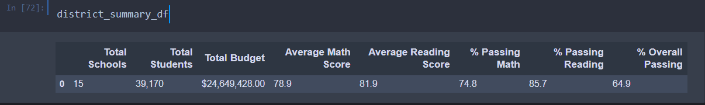

# School District Analysis 

## Overview of School District Analysis 
The purpose of this analysis is to clean, analyze and report the school district data in order to gain insights and trends about the schools and find out which schools are succeeding and which ones are failing in their objectives, why they are succeeding or failing and using insights from this data to make policy changes. The two datasets, school data and student data contains a number of variables such as school name, school budget, math and reading scores, student name, student ID, student grade etc. We leverage the pandas library and manipulate these variables to give us a number of different snapshots of our data. Manipulating these variables allow us to create a number of different metrics such as percentage of students passing math, percentage of students passing reading or passing both math and reading and group these variables by school name. We also calculate find our per capita spending for each student at each school, help us analyze grades by school size and school type (district or charter). By analyzing data by school size, spending, school name, it gives us different angles of the same dataset and helps in making policy decisions which can help succeeding schools continue their pattern and failing schools have interventions to improve key metrics such as reading and math scores. In simple, the analysis will help us use data to help aid our decision making. 

In our first PyCitySchools Analysis, we simply clean, organize and analyze the data according to our desired metrics mentioned above. However, we find reports of academic dishonesty in the 9th grade reading and math scores of Thomas High School, so we change all 9th grade reading and math scores in Thomas High School to NAN value in order to ensure this data is not used in our analysis since it is inaccurate data due to academic dishonesty. After making this change we redo the analysis after this change in 9th grade results for Thomas and we generate the same key metrics after the adjustment. Therefore, we will see how this adjustment in 9th grade math and reading scores at Thomas High School has an impact on the School District Analysis. 

## Results 
It is self explanatory that when we change our dataset, our results will also change. Therefore, we will compare how changes in Thomas High Schools 9th grade results has ultamitely affected our results. 

### How is the district summary affected?
The following are the screenshots of the two district summary. 

                    Module District Summary 

                    Challenge District Summary

