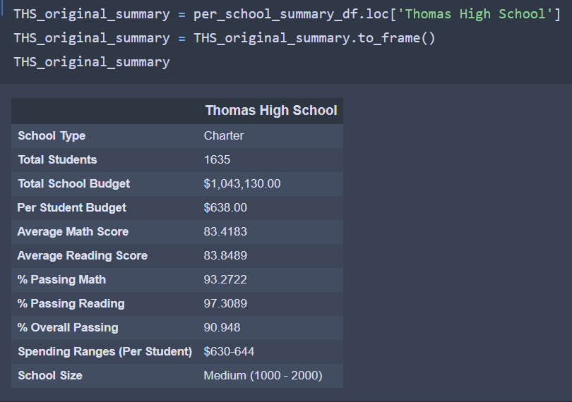
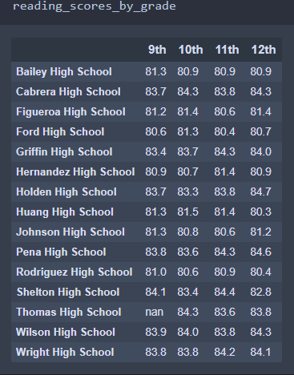

# School District Analysis 

## Overview of School District Analysis 
The purpose of this analysis is to clean, analyze and report the school district data in order to gain insights and trends about the schools and find out which schools are succeeding and which ones are failing in their objectives, why they are succeeding or failing and using insights from this data to make policy changes. The two datasets, school data and student data contains a number of variables such as school name, school budget, math and reading scores, student name, student ID, student grade etc. We leverage the pandas library and manipulate these variables to give us a number of different snapshots of our data. Manipulating these variables allow us to create a number of different metrics such as percentage of students passing math, percentage of students passing reading or passing both math and reading and group these variables by school name. We also calculate find our per capita spending for each student at each school, help us analyze grades by school size and school type (district or charter). By analyzing data by school size, spending, school name, it gives us different angles of the same dataset and helps in making policy decisions which can help succeeding schools continue their pattern and failing schools have interventions to improve key metrics such as reading and math scores. In simple, the analysis will help us use data to help aid our decision making. 

In our first PyCitySchools Analysis, we simply clean, organize and analyze the data according to our desired metrics mentioned above. However, we find reports of academic dishonesty in the 9th grade reading and math scores of Thomas High School, so we change all 9th grade reading and math scores in Thomas High School to NAN value in order to ensure this data is not used in our analysis since it is inaccurate data due to academic dishonesty. After making this change we redo the analysis after this change in 9th grade results for Thomas and we generate the same key metrics after the adjustment. Therefore, we will see how this adjustment in 9th grade math and reading scores at Thomas High School has an impact on the School District Analysis. 

## Results 
It is self explanatory that when we change our dataset, our results will also change. Therefore, we will compare how changes in Thomas High Schools 9th grade results has ultamitely affected our results. 

### How is the district summary affected?
The following are the screenshots of the two district summary. 

#### Module District Summary              

#### Challenge District Summary 

Immediately after making changes to the School District Dataset after reports of academic dishonesty from 9th grade students at Thomas High School, we see changes in key metrics in the district summary between original analysis and the modified analysis which excludes grades of 9th grade students at Thomas High School. In the modified district summary, compared to the original we see a 0.1 decrease in average math scores from 79 to 78.9 while average reading scores remain the same at 81.9. The percentage passing math falls by 0.2% from 75% to 74.8% and percentage reading falls by 0.3% from 86% to 85.7% after the modification. The overall passing percentage for the modified summary fell by 0.1% from 65% to 64.9%. Therefore, there is a small impact of the modifications as we do see very slight changes in all metrics of between 0.1-0.3 points. 

### How is the school summary affected?

We know that in the modified dataset we only made changes to 9th grade results in Thomas High School. Therefore, we know any changes to the school summary may only come from changes in results in the Thomas High School results. Therefore, I will display the original Thomas High School results and the modified results that reflect changes following the reports of academic dishonesty in the 9th grade results. 

The folowing are screenshots of original and modified summaries of Thomas High School. 

#### Thomas High School Original Results 

#### Thomas High School Modified Results 

We see that total students, school budget, per capita budget, size and spending ranges are the same for obvious reasons as that data was never altered, rather only school grades. We can see changes in the school grades data. We see that average math score has changed slightly from 83.41 which was the original score to 83.35 the modified score, a very small decrease of 0.06. We see that reading The original average reading score was around 83.85 compared to the modified score of approximately 83.90, a 0.05 point increase.The math passing percentage fell from 93.27 to 93.18, a 0.09 % change, reading passing percentage fell from 97.3% to 97.01% an almost 0.3% decrease. It is also odd that average reading scores relative to original analysis have increased but percentage passing for reading fell.  Lastly overall passing fell from 90.95% to 90.63% relative to other metrics a large 0.23% decrease. We see that most scores have decreased, meaning on average 9th grade students performed better than 10th, 11th and 12th grade students except for in reading scores. but may also show that higher scores and passing percentages are indicative of some sort of academic dishonesty claims which were made. 

## How does changing 9th grade scores affect Thomas's performance relative to other schools?

As we know from above, the changes to the 9th grade results means that Thomas High School's grades and passing percentages were slightly impacted. Therefore, it might be insightful to see how significantly this change impacted Thomas High School's performance relative to other schools. Let's take a look at the top 5 schools by overall passing percentage. 

#### Original Top 5 Schools by Overall Passing Percentage 

#### Modified Top 5 Schools by Overall Passing Percentage 

We find that Thomas High School was ranked 2nd among top 5 schools in the Original Top 5 Overall Passing Percentage. Thomas High School managed to retain its 2nd position. In the original analysis, it was much closer to Canbrera High School having an overall passing percentage only 0.2% percentage less than Canbrera which has 91.33% compared to Thomas's 90.95%. However, after the modification it is 0.5% less than Canbrera. Thomas now has an overall passing percentage of 90.63% compared to its previous 90.95%. It's overall passing percentage reduction almost lead to Thomas High almost falling to 3rd place where Griffin High has an overall passing percentage of 90.59% , a very small difference of 0.04%. Originally, Thomas High School had an Average Math and Reading scores of 83.41 and 83.85 respectively, compared to Canbrera's Average Math and Reading scores of 83.06 and 83.97 and Griffin High's Average Math and Reading scores of 83.351 and 83.82. After the modification Thomas's Average Math slightly fell to 83.350, 0.001 lower than Griffin's and Average Reading rose to 83.89. In general the changes in scores had little effect on Thomas's performance relative to other schools as the changes were small. 

### How does replacing the ninth-grade scores affect the following:

### Math and reading scores by grade

We know that after making changes to 9th grade results from Thomas High School the significant difference between the two analysis will be that in the Math scores and Reading Scores by grade analysis, 9th grade Thomas High School grades will have nan value, since those results changed after reports of academic dishonesty. 

#### Original Math Scores by Grade 

#### Modified Math Scores by Grade 

As we can see, 9th grade results for Average Math score for Thomas was 83.6 and after the modification it is now a nan value. In fact, the original 9th grade average math results were similar to Pena High School which also had 83.6, the joint second highest average math score. Otherwise 10th, 11th and 12th grade results remain unchanged at 83.1, 83.5 and 83.5.

#### Original Reading Scores by Grade 

#### Modified Reading Scores by Grade 

Similarly, for the 9th grade reading scores we have a value of 83.7 in the original analysis and after the modifications we have nan values while values for 10th, 11th and 12th remain the same at 84.3, 83.6 and 83.8. 

### Scores by school spending

#### Original Scores by Spending

#### Modified Scores by Spending

The impact on scores by school spending will depend on the spending range of Thomas High School. We know from the above Thomas High School summary that the spending range for Thomas High School is 630-644 so any impact may only be on grades in that spending range. However, we see in the image above that there are no changes in the data, This might be because the modification had very little impact on average scores and percentages at Thomas High School. Since, spending bins involve multiple schools, the change are so minimal that they are not reflected in the Average Scores by Spending. 

### Scores by school size

Scores by school type
